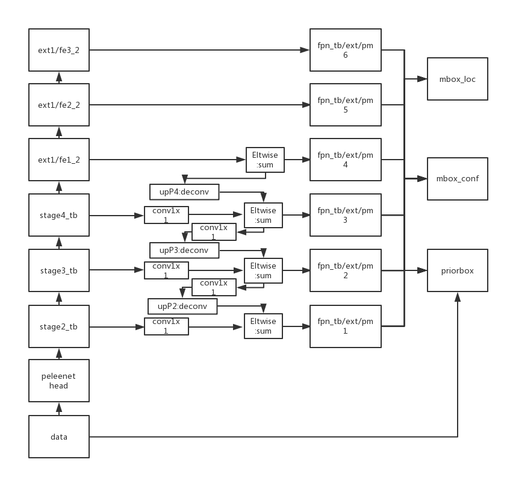

# Pelee: A Real-Time Object Detection System on Mobile Devices
This repository contains the code for the following paper. 

[Pelee: A Real-Time Object Detection System on Mobile Devices](https://arxiv.org/pdf/1804.06882.pdf) (ICLR 2018 workshop track)

The code is based on the [SSD](https://github.com/weiliu89/caffe/tree/ssd) framework. 

### Citation
If you find this work useful in your research, please consider citing:

```
@article{wang2018pelee,
  title={Pelee: A Real-Time Object Detection System on Mobile Devices},
  author={Wang, Robert J and Li, Xiang and Ao, Shuang and Ling, Charles X},
  journal={arXiv preprint arXiv:1804.06882},
  year={2018}
}
```
## Results on VOC 2007

The table below shows the results on PASCAL VOC 2007 test.

| Method | mAP (%) | FPS (Intel i7) |FPS (iPhone 6s) |FPS (iPhone 8) | # parameters 
|:-------|:-----:|:-------:|:-------:|:-------:|:-------:|
| YOLOv2-288 | 69.0 | 1.0 | - | - | 58.0M |
| DSOD300_smallest| 73.6 | 1.3 | - | - |5.9M |
| Tiny-YOLOv2 | 57.1 | 2.4 | 9.3 | 23.8 | 15.9M |
| SSD+MobileNet | 68.0 | 6.1 | 16.1 | 22.8 |5.8M |
| Pelee | 70.9 | 6.7 | 17.1 | 23.6 | 5.4M |

| Method | 07+12 | 07+12+coco 
|:-------|:-----:|:-------:|
| SSD300 | 77.2 | 81.2|
| SSD+MobileNet | 68 | 72.7|
| Pelee | [70.9](https://drive.google.com/open?id=1KJHKYQ2nChZXlxroZRpg-tRsksTXUhe9) | [76.4](https://drive.google.com/open?id=1ZKAP9d7Hzxi9Jc09ApL2BH1SgXXZPJk4)|
| Pelee+fpn | 72.7 | - |

# framework
Pelee+fpn framework


## Results on COCO
The table below shows the results on COCO test-dev2015.

| Method | mAP@[0.5:0.95] | mAP@0.5 |mAP@0.75|Computational Cost (MACs) | # parameters 
|:-------|:-----:|:-------:|:-------:|:-------:|:-------:|
| SSD300 | 25.1 | 43.1 | 25.8 | 34,360 M | 34.30 M |
| YOLOv2-416| 21.6 | 44.0 | 19.2 | 17,500 M|67.43 M |
| SSD+MobileNet | 18.8 | - | - | 1,200 M | 6.80 M |
| Pelee | 22.4 | 38.3 | 22.9 | 1,290 M |5.98 M |

## Preparation 

0. Install SSD (https://github.com/weiliu89/caffe/tree/ssd) following the instructions there, including: (1) Install SSD caffe; (2) Download PASCAL VOC 2007 and 2012 datasets; and (3) Create LMDB file. Make sure you can run it without any errors.

1. Download the pretrained [PeleeNet](https://drive.google.com/file/d/1OBzEnD5VEB_q_B8YkLx-i3PMHVO-wagk/view?usp=sharing) model. By default, we assume the model is stored in $CAFFE_ROOT/models/
2. Clone this repository and create a soft link to $CAFFE_ROOT/examples 
  ```shell
  git clone https://github.com/Robert-JunWang/Pelee.git
  ln -sf `pwd`/Pelee $CAFFE_ROOT/examples/pelee
  ```
## Training & Testing

- Train a Pelee model on VOC 07+12:

  ```shell
  cd $CAFFE_ROOT
  python examples/pelee/train_voc.py
  ```
- Evaluate the model:

  ```shell
  cd $CAFFE_ROOT
  python examples/pelee/eval_voc.py


## Models
- PASCAL VOC 07+12: [Download (20.3M)](https://drive.google.com/open?id=1KJHKYQ2nChZXlxroZRpg-tRsksTXUhe9)
- PASCAL VOC 07+12+coco: [Download (20.3M)](https://drive.google.com/open?id=1ZKAP9d7Hzxi9Jc09ApL2BH1SgXXZPJk4) 
- PASCAL VOC 07_12(pelee+fpn:72.7): [Download (22.2M)](https://pan.baidu.com/s/1zMA4e690ZXgfuLuFSt3H4A)密码: 1zcu
- MS COCO: [Download (21M)](https://drive.google.com/open?id=1NXfmytr_55Njg8h6MXVflo3-tvhxYdm8) 
